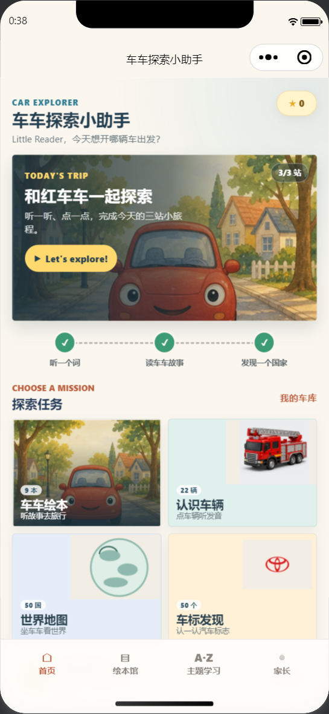
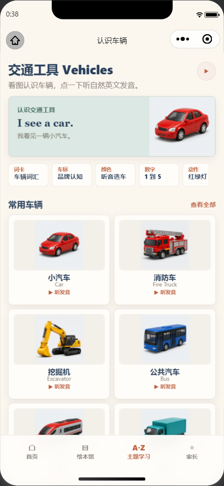
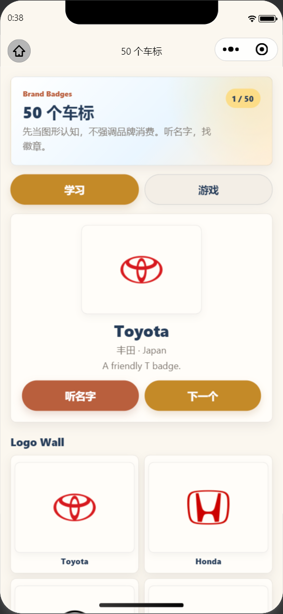

# 车车探索小助手

<p align="center">
  
</p>

<p align="center">
  面向 4-5 岁儿童的小汽车主题语言启蒙互动应用。<br />
  通过听、点、看、跟读原声和完成小游戏，让孩子在车辆探索中自然接触英语。
</p>

<p align="center">
  
  
  
</p>

## 项目简介

车车探索小助手是一款以汽车为主题的儿童互动启蒙产品，优先适配微信小程序，同时支持 H5 预览。产品强调大按钮、低阅读门槛、自然语音、正向反馈和短时任务，不要求儿童具备英文阅读能力。

当前版本不包含登录、社交、排行榜、麦克风或录音功能。学习进度、星星和奖励记录默认保存在当前设备。

<table>
  <tr>
    <td></td>
    <td></td>
    <td></td>
  </tr>
  <tr>
    <td align="center">探索首页</td>
    <td align="center">车辆认知</td>
    <td align="center">50 个车标</td>
  </tr>
</table>

## 主要功能

- 汽车探索首页：集中进入绘本、车辆、车标、颜色、数字、交通和世界地图内容。
- 车辆认知：通过高清车辆图片、英文单词和自然语音认识常见车辆。
- 50 个车标：浏览常见汽车品牌标志，支持分页学习与语音播放。
- 颜色与数字：完成颜色汽车听辨、数车等低龄互动任务。
- 交通动作：通过红绿灯和车辆动作学习简单指令。
- 汽车绘本：提供车辆主题绘本、逐页朗读、中文辅助和点读互动。
- 车车看世界：包含 50 个国家及地图主题词汇。
- 星星与车库：完成任务获得星星和车辆奖励。
- 家长中心：查看阅读、词汇、练习和连续学习记录。
- 分享转发：各页面支持微信好友分享和朋友圈分享。

## 技术栈

- Vue 3 + TypeScript
- uni-app / `@dcloudio/uni-app`
- Pinia
- Vite
- Sass
- 微信云开发存储
- `uni.getStorageSync` / `uni.setStorageSync` 本地进度持久化

## 快速开始

### 环境要求

- Node.js `^20.19.0` 或 `>=22.12.0`
- npm
- 微信开发者工具（运行小程序时需要）

### 安装依赖

```bash
git clone https://github.com/StringsLi/cartown-english.git
cd cartown-english
npm install
```

### H5 本地预览

```bash
npm run dev:h5
```

终端会输出本地访问地址，默认通常为 `http://localhost:5173/`。

### 构建微信小程序

```bash
npm run build:mp-weixin
```

构建完成后，可在微信开发者工具中导入项目根目录。`project.config.json` 已将小程序目录配置为：

```text
dist/build/mp-weixin/
```

也可以直接导入该构建目录进行预览。

## 小程序配置

### AppID

在以下两个文件中配置自己的小程序 AppID：

- `src/manifest.json` 的 `mp-weixin.appid`
- `project.config.json` 的 `appid`

> `AppSecret` 只能保存在服务端或安全的 CI/CD 密钥中，绝不能写入前端代码、配置文件或提交到 GitHub。

### 云存储

云环境配置位于 `src/config/cloud.ts`：

```ts
export const CLOUD_ENV_ID = "your-cloud-env-id";
export const CLOUD_STORAGE_BUCKET = "your-cloud-storage-bucket";
```

高清资源应按原目录结构上传到：

```text
apps/cartown-english/source-assets/
```

对应的本地高清源文件位于 `docs/source-assets/`。当前版本只依赖云存储分发媒体，不要求云数据库或云函数。

小程序首次访问云端图片或音频时会下载并保存到本地文件系统。媒体缓存上限为 80MB，达到上限后按最近使用时间自动清理旧文件，避免用户每次打开都重复下载。

## 常用命令

| 命令 | 用途 |
| --- | --- |
| `npm run dev:h5` | 启动 H5 开发环境 |
| `npm run build:h5` | 构建 H5 并复制高清资源 |
| `npm run dev:mp-weixin` | 启动微信小程序开发编译 |
| `npm run build:mp-weixin` | 构建微信小程序生产包 |
| `npm run type-check` | 执行 TypeScript 类型检查 |
| `npm run validate:content` | 校验课程、图片和音频资源 |
| `npm run check:release` | 执行发布前严格内容检查 |
| `npm run test` | 执行类型检查与内容校验 |

## 项目结构

```text
cartown-english/
├─ docs/
│  ├─ source-assets/       # 高清图片、车标与音频源文件
│  └─ ui-audit/            # 页面视觉检查截图
├─ scripts/                # 内容校验、音频生成与构建辅助脚本
├─ src/
│  ├─ components/          # 通用 UI 与媒体组件
│  ├─ composables/         # 页面分享等组合式逻辑
│  ├─ config/              # 云环境配置
│  ├─ mock/                # 绘本、车辆、国家与主题课程数据
│  ├─ pages/               # 小程序页面
│  ├─ services/            # 音频、云资源、缓存与学习进度服务
│  ├─ stores/              # Pinia 状态管理
│  ├─ styles/              # 全局样式与设计变量
│  └─ types/               # TypeScript 类型定义
├─ project.config.json     # 微信开发者工具项目配置
├─ src/manifest.json       # uni-app 应用与平台配置
└─ src/pages.json          # 页面路由和导航配置
```

## 内容与隐私

- 课程数据与媒体引用集中维护，新增内容时请同步执行 `npm run validate:content`。
- 车标素材来源说明见 `docs/source-assets/CAR_LOGO_SOURCES.md`。
- 应用不采集麦克风或录音信息，不包含儿童社交和排行榜。
- 学习记录默认保存在本地；清除小程序数据后，本地学习记录会一并清除。

## 发布检查

```bash
npm run test
npm run check:release
npm run build:mp-weixin
```

随后在微信开发者工具中检查真机图片、音频、分享入口、学习进度和包体积，再上传体验版或提交审核。
