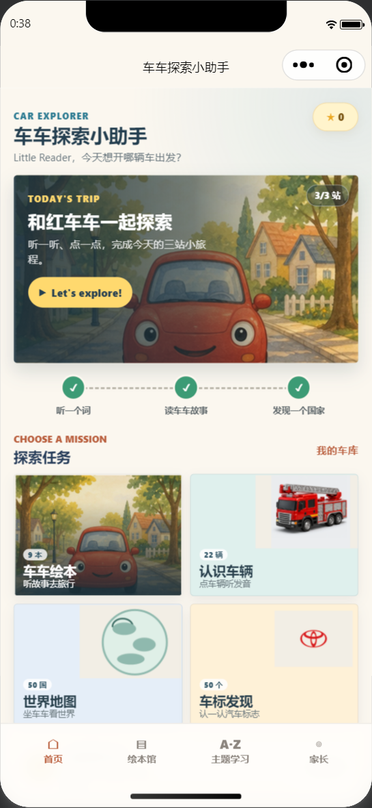
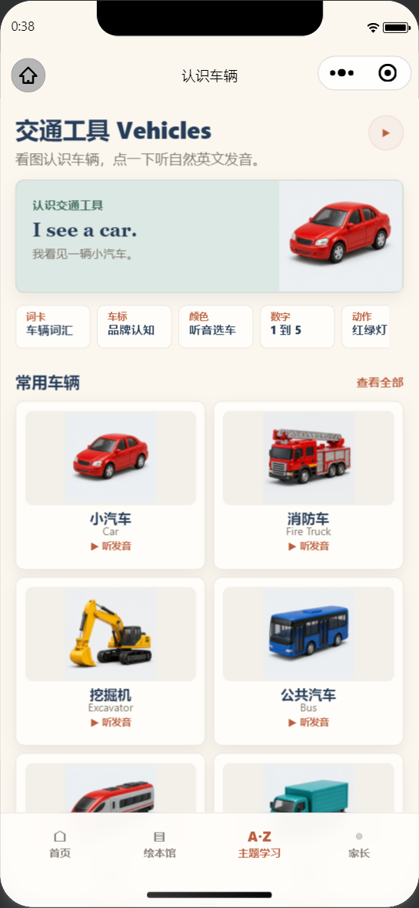
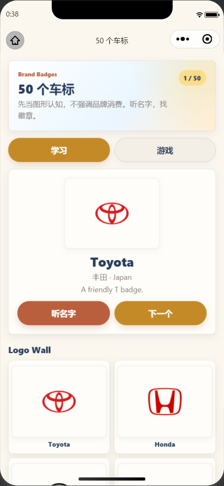
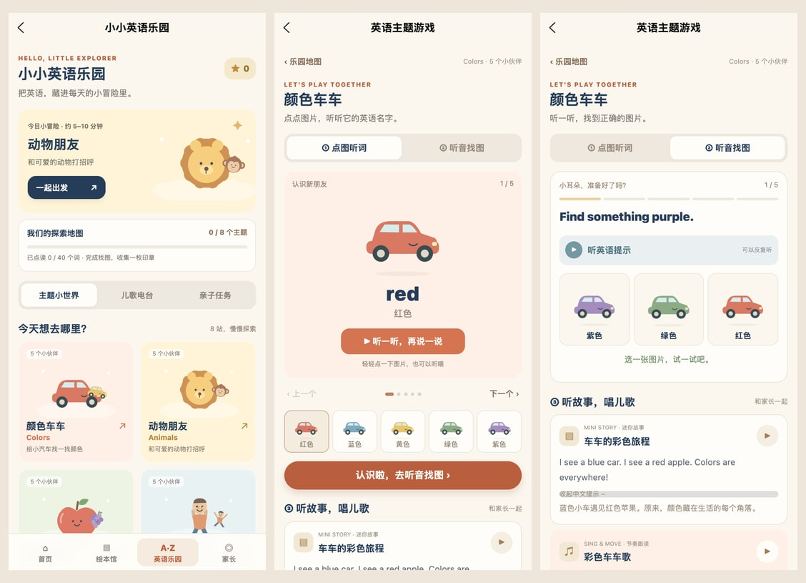
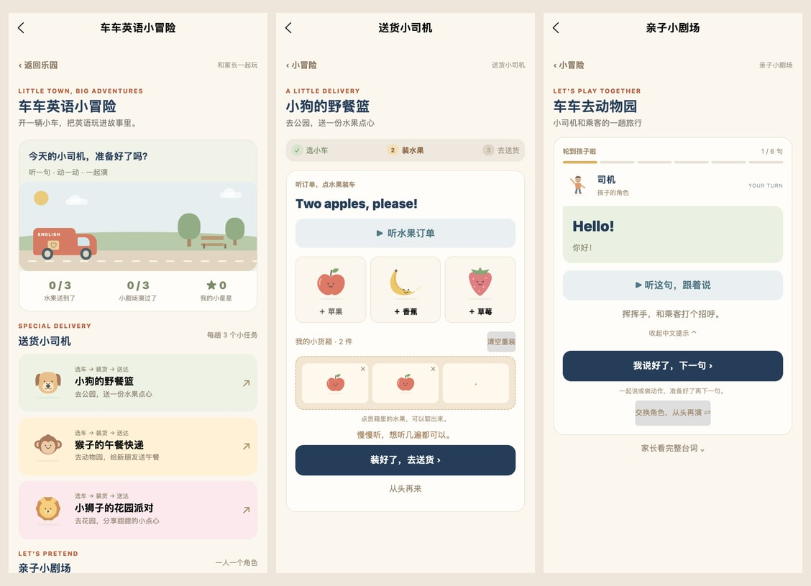

# 车车英语乐园

<p align="center">
  
</p>

<p align="center">
  面向 4-5 岁儿童的汽车探索与亲子英语启蒙小程序。<br />
  从车车故事出发，也能玩颜色、动物、水果、动作、数字、形状、天气和心情八个短时主题。
</p>

<p align="center">
  
  
  
</p>

## 项目简介

车车英语乐园是一款以汽车为主题的儿童互动启蒙微信小程序，并融合了“小小英语乐园”的八个亲子英语主题。产品强调大按钮、低阅读门槛、自然语音、正向反馈和短时任务，不要求儿童具备英文阅读能力。

当前版本不包含登录、社交或排行榜。跟读练习会在用户主动点击录音后申请麦克风权限，录音和学习记录默认保存在当前设备。

<table>
  <tr>
    <td></td>
    <td></td>
    <td></td>
  </tr>
  <tr>
    <td align="center">探索首页</td>
    <td align="center">车辆认知</td>
    <td align="center">50 个车标</td>
  </tr>
</table>

## 主要功能

- 汽车探索首页：集中进入绘本、车辆、车标、颜色、数字、交通和世界地图内容。
- 小小英语乐园：8 个主题、40 个配图词汇；先点图听词，再完成随机听音找图游戏。每个主题都有迷你故事、原创节奏儿歌和线下亲子任务。
- 车车英语小冒险：6 个送货故事串联颜色、水果、数量和目的地；6 个亲子小剧场支持逐句点读、交换角色和线下续玩。
- 车辆认知：通过高清车辆图片、英文单词和自然语音认识常见车辆。
- 50 个车标：浏览常见汽车品牌标志，支持分页学习与语音播放。
- 颜色与数字：完成颜色汽车听辨、数车等低龄互动任务。
- 交通动作：通过红绿灯和车辆动作学习简单指令。
- 汽车绘本：提供车辆主题绘本、逐页朗读、中文辅助和点读互动。
- 跟读练习：支持原声对照、最长 10 秒录音、本地回放以及录音备份导入导出。
- 车车看世界：包含 50 个国家及地图主题词汇。
- 星星与车库：完成任务获得星星和车辆奖励。
- 家长中心：查看阅读、词汇、练习和连续学习记录。
- 英语主题进度：首次完成每个主题获得一颗星星和探索印章；点读词汇单独记录为“已点读”，进度显示在乐园及家长中心，保存在当前设备。
- 分享转发：各页面支持微信好友分享和朋友圈分享。

## 技术栈

- Vue 3 + TypeScript
- uni-app / `@dcloudio/uni-app`
- Pinia
- Vite
- Sass
- 微信云开发存储
- `uni.getStorageSync` / `uni.setStorageSync` 本地进度持久化

## 快速开始

### 环境要求

- Node.js `^20.19.0` 或 `>=22.12.0`
- npm
- 微信开发者工具（运行小程序时需要）

### 安装依赖

```bash
git clone https://github.com/StringsLi/cartown-english.git
cd cartown-english
npm install
```

### 构建微信小程序

```bash
npm run build:mp-weixin
```

构建完成后，可在微信开发者工具中导入项目根目录。`project.config.json` 已将小程序目录配置为：

```text
dist/build/mp-weixin/
```

也可以直接导入该构建目录进行预览。

## 小程序配置

### AppID

在以下两个文件中配置自己的小程序 AppID：

- `src/manifest.json` 的 `mp-weixin.appid`
- `project.config.json` 的 `appid`

> `AppSecret` 只能保存在服务端或安全的 CI/CD 密钥中，绝不能写入前端代码、配置文件或提交到 GitHub。

### 云存储

云环境配置位于 `src/config/cloud.ts`：

```ts
export const CLOUD_ENV_ID = "your-cloud-env-id";
export const CLOUD_STORAGE_BUCKET = "your-cloud-storage-bucket";
```

高清资源应按原目录结构上传到：

```text
apps/cartown-english/source-assets/
```

对应的本地高清源文件位于 `docs/source-assets/`。当前版本只依赖云存储分发媒体，不要求云数据库或云函数。

小程序首次访问云端图片或音频时会下载并保存到本地文件系统。媒体缓存上限为 80MB，达到上限后按最近使用时间自动清理旧文件，避免用户每次打开都重复下载。

## 常用命令

| 命令 | 用途 |
| --- | --- |
| `npm run dev:mp-weixin` | 启动微信小程序开发编译 |
| `npm run build:mp-weixin` | 构建微信小程序生产包 |
| `npm run type-check` | 执行 TypeScript 类型检查 |
| `npm run validate:content` | 校验课程、图片和音频资源 |
| `npm run check:release` | 执行发布前严格内容检查 |
| `npm run test:adventures` | 校验货物判断、旧进度迁移、首次奖励与持久化 |
| `npm run test` | 类型、内容、冒险、学习、录音、页面行为和媒体缓存回归检查 |

## 项目结构

```text
cartown-english/
├─ docs/
│  ├─ source-assets/       # 高清图片、车标与音频源文件
│  └─ ui-audit/            # 页面视觉检查截图
├─ scripts/                # 内容校验、音频生成与构建辅助脚本
├─ src/
│  ├─ components/          # 通用 UI 与媒体组件
│  ├─ composables/         # 页面分享等组合式逻辑
│  ├─ config/              # 云环境配置
│  ├─ mock/                # 绘本、车辆、国家与主题课程数据
│  ├─ pages/               # 小程序页面
│  ├─ services/            # 音频、云资源、缓存与学习进度服务
│  ├─ stores/              # Pinia 状态管理
│  ├─ styles/              # 全局样式与设计变量
│  └─ types/               # TypeScript 类型定义
├─ project.config.json     # 微信开发者工具项目配置
├─ src/manifest.json       # uni-app 应用与平台配置
└─ src/pages.json          # 页面路由和导航配置
```

## 内容与隐私

- 课程数据与媒体引用集中维护，新增内容时请同步执行 `npm run validate:content`。
- 英语乐园的 40 段单词发音、40 段提示、8 段故事和 8 首原创短儿歌分别随 `pkg-learning`（单词、提示、故事）和 `pkg-music`（儿歌）分包离线提供。歌词与伴奏为本项目原创，人声用 [Piper](https://github.com/OHF-Voice/piper1-gpl) 和 [en_US-ljspeech-high 声线](https://huggingface.co/rhasspy/piper-voices/blob/main/en/en_US/ljspeech/high/MODEL_CARD) 在开发阶段合成。该声线从公开领域的 LJ Speech 数据集独立训练，模型库标注 MIT 许可；模型和生成工具未打包进小程序。要重新生成，安装 `piper-tts numpy imageio-ffmpeg`，下载声线 `.onnx` 和 `.onnx.json`，运行 `PIPER_MODEL=/path/to/en_US-ljspeech-high.onnx python3 scripts/generate-playground-audio.py`。音频不包含原先链接的商业儿歌录音。
- 车标素材来源说明见 `docs/source-assets/CAR_LOGO_SOURCES.md`。
- 应用仅在用户主动开始跟读录音时申请麦克风权限，不包含儿童社交和排行榜。
- 跟读录音默认只保存在当前设备，不会自动上传到云端，可由家长手动导入或导出备份。
- 在“家长中心 → 孩子的录音小册”可回听最近 12 条录音。点“导出音频”准备单条 MP3，再点“保存到微信文件”，选择文件传输助手或自己的聊天，随后在聊天文件中收藏或下载到电脑。点“备份全部录音”生成 JSON 恢复文件，“导入备份”可合并恢复；已失效的录音会明确跳过。网页版本提供下载按钮。微信真机发送尚未验证，检查记录见 [录音导出与恢复](docs/ui-audit/record-export/README.md)。
- 录音小册支持按句子与绘本筛选、回放状态和存满提醒。跟读等待系统确认再开始，10 秒自动保存，保存失败可在当前页面重试；导入时跳过已有有效文件，修复缺失录音，避免重复写文件。录制用于微信小程序，网页支持回听与导出；详细验证见 [录音保存与回听优化](docs/ui-audit/record-polish/README.md)。
- 学习记录默认保存在本地；清除小程序数据后，本地学习记录会一并清除。
- 小冒险的 34 段对话复用上述 Piper 声线，由 `scripts/generate-adventure-audio.py` 在开发阶段生成，随单独的 `pkg-adventure` 分包离线提供。运行 `PIPER_MODEL=/path/to/en_US-ljspeech-high.onnx python3 scripts/generate-adventure-audio.py --force` 可重新生成。插画复用本项目原创绘图，在新分包内另存小尺寸 PNG，避免跨分包读取资源。
- 亲子小剧场由家长和孩子点击确认完成，不使用麦克风或语音评分；“演过”表示陪玩记录。每个送货故事和剧场场景仅首次完成获得一颗星星，旧版车辆、主题和星星进度保留。

## 发布检查

```bash
npm run test
npm run check:release
npm run build:mp-weixin
```

随后在微信开发者工具中检查真机图片、音频、分享入口、学习进度和包体积，再上传体验版或提交审核。

### 乐园插画与页面预览

- 40 张词汇插画、8 张主题场景为本项目原创矢量绘图，PNG 随学习分包提供。矢量源文件位于 `docs/source-assets/playground-vectors`，生成脚本为 `scripts/generate-playground-art.cjs`；安装 `sharp` 后运行 `node scripts/generate-playground-art.cjs` 可重新导出。
- 页面分成主题地图、儿歌电台和亲子任务，支持探索印章、中文故事提示及停止播放。



页面检查结果见 [乐园预览与检查记录](docs/ui-audit/playground-expansion/README.md)。

## 车车英语小冒险

首页和英语乐园都有新入口，全部使用 uni-app 的 `view`、`image`、`button`、页面生命周期和分享接口实现，可构建为微信小程序。

| 玩法 | 场景 | 交互 |
| --- | --- | --- |
| 送货小司机 | 野餐篮、午餐快递、花园派对，以及森林早餐、水果便当、花园茶会 | 听颜色选车 → 按订单装水果 → 找目的地；可取出水果、清空重装和重玩 |
| 亲子小剧场 | 动物园、水果店、小巴士，以及泡泡洗车屋、修车小工坊、小小加油站 | 选择孩子角色 → 6 句轮流表演 → 交换角色；支持完整台词点读、中文提示和上一句 |

装货和对话阶段收起场景插画，突出可点选内容。完成后展示印章与离屏游戏建议，家长报告同步显示送达及表演数量。页面切后台、返回或切换任务时停止播放。



检查记录见 [小冒险预览与检查](docs/ui-audit/adventure/README.md)。

### 小车生活篇

“初次出发”和“小车生活篇”分栏展示，每篇有 3 趟送货和 3 个亲子剧场。生活篇增加求助、清洁、道谢和告别的日常表达，配套洗车屋、修车店、加油站原创 CSS 场景及 17 段新语音。每个新故事首次完成再获得一颗星，既有 6 个故事的进度继续保留。

新版检查记录见 [小车生活篇](docs/ui-audit/car-life/README.md)。

### 学习体验升级

儿童首页增加每日听词、找图和故事小旅程，以及主题游戏的继续入口。声音支持播放状态、重播和保存音量。错词优先复习，独立找对后按 1、3、7 天再次见面；家长报告区分听过与独立找对，旧进度保留。

实际操作截图、测试范围及微信真机检查限制见 [学习体验检查记录](docs/ui-audit/learning-flow/README.md)。

### 2026-10-03：车辆插画升级

小冒险和乐园颜色卡片采用六款独立的透明 3D 车辆插画，按故事和颜色对应车型。素材提示词、页面截图与验证记录见 [车辆升级记录](docs/ui-audit/vehicle-refresh/README.md)。

### 全页面体验与工程检查

统一 24 个页面的导航、声音清理、卡片视觉与按钮语义。绘本增加续读和配图游戏，颜色/车标/动作答对后主动下一题，数车数量一致；车库刷新收藏，国家当天点读独立记录，家长报告使用可核对的数量。79 张基础绘本、车辆和词汇图片随包离线提供。

新增 `npm run test:pages` 和 `npm run test:media-cache`，GitHub Actions 执行测试、严格内容校验与包体检查。手机宽度检查、效果图、包体余量和微信真机未验收项见 [全页面检查记录](docs/ui-audit/pages/README.md)。

### 图片加载修复（2026-10-04）

网页版本直接包含仓库中已有的 211 张原图，绘本封面和车标无需微信云环境即可显示；故事车辆复用阅读分包本地图片，车标接入媒体缓存。小程序保留原有云图片路径和包体限制。

```bash
npm run dev:h5
npm run build:h5
```

新增图片路由与网页输出完整性检查。浏览器验证、效果图和检查范围见 [图片加载修复记录](docs/ui-audit/image-loading-fix/README.md)。


### 太阳系英语系列

在「小小英语乐园」主题页进入「太阳系小旅行」；首页六个世界中的「太阳系旅行」直接进入。

- 三组系列：我们的太空邻居、四颗岩石行星、远方的大行星。
- 太阳、八大行星和月球共 10 份双语图鉴，提供英文名字、短句、科学小知识和亲子任务。
- 可暂停的轨道示意图；点天体进入图鉴。距离、大小、速度为示意，不按真实比例。
- 32 段离线音频：每个天体的名字、句子和找图提示，以及两段答题反馈。
- 听音找图每站随机出题，首次完整完成收集一颗星星与一枚印章；重复完成不重复奖励。
- 太空护照保存在本机；「清除本地学习记录」同时清除太空进度。
- 图片与音频在 `pkg-space` 独立分包，确保旧主题包大小不增加媒体负担。

图片沿用 [ORBIT](https://github.com/ryh842487118-bot/orbit) 的 Solar System Scope 纹理，缩小并压缩为 JPEG。纹理按 CC BY 4.0 保留来源与修改说明；详情见 `docs/source-assets/orbit/`。新页面以小程序原生视图实现，未引入 Three.js / WebGL 依赖。

验证：`npm run test:space`。重新生成音频：`PYTHONPATH=/path/to/piper-libs PIPER_MODEL=/path/to/en_US-ljspeech-high.onnx python3 scripts/generate-space-audio.py`。

### 首页与陪玩入口重排（2026-10-04）

首页常驻展示六个世界，并提供真车/颜色/数字/动作练习与儿歌/亲子任务/录音快捷入口。顶部优先继续上次主题进度；儿歌、亲子任务直接展示对应标签内容。手机尺寸检查、效果图、包体余量和下一步方向见 [排版检查记录](docs/ui-audit/home-layout/README.md)。
