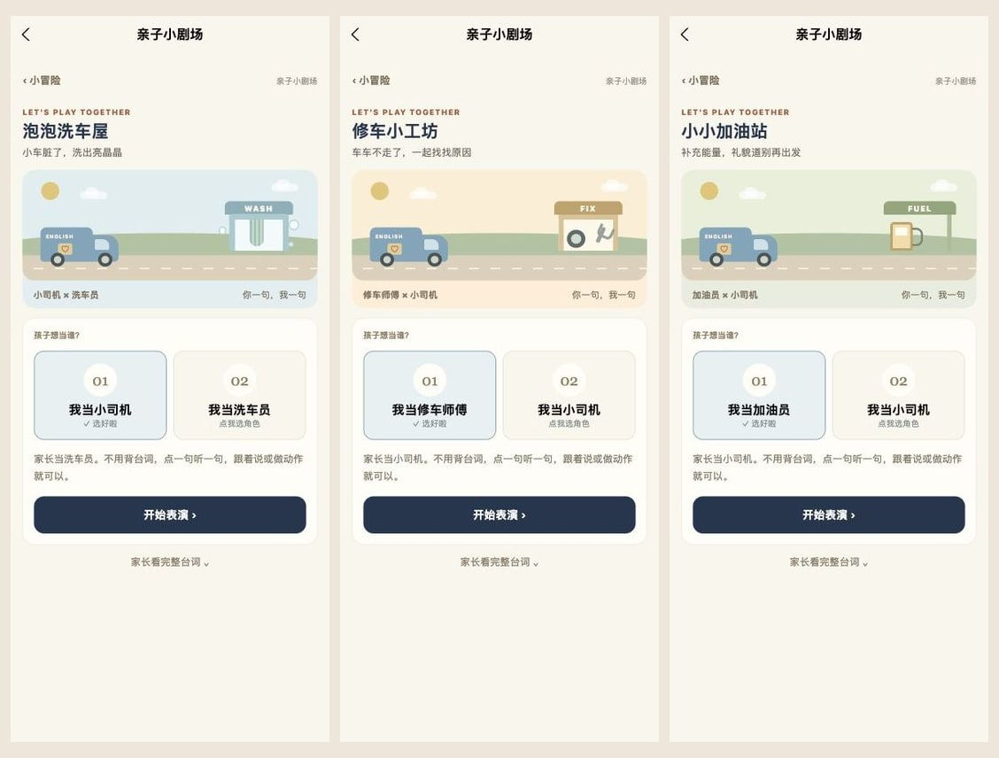

# 小车生活篇

2026-10-02：新增 3 个送货任务、3 个亲子小剧场、17 段离线语音。小冒险合计 6 个送货故事、6 个剧场、34 段语音。两篇内容分栏展示，默认打开“小车生活篇”。

## 新内容

- 送货：大象的森林早餐（三个苹果）、企鹅的水果便当（两根香蕉）、小狗的花园茶会（两颗草莓）。
- 剧场：泡泡洗车屋、修车小工坊、小小加油站。每个剧场包含 6 句交替台词、中文提示、动作及纸盒/玩具车的线下续玩建议。
- 洗车屋、修车店和加油站使用原创 CSS 场景，复用现有页面与离线音频服务。
- “下一趟”先推荐同篇未完成故事；同篇玩完后推荐另一篇，全部完成后隐藏该按钮。

## 验证

- 类型检查、严格内容校验、微信构建及包体积门槛通过：主包 1.354 MiB，冒险分包 0.390 MiB，全部分包低于 2 MiB。
- 34 段 MP3 全部成功解码，时长 0.59–2.14 秒，无空白音频。
- 通过电脑上的浏览器操作完整试玩 6 个新故事：三种新水果订单正确装货送达；三个剧场的 18 句台词按顺序点读及确认；修车剧场选择孩子为小司机后正确轮到家长先说。
- 六个新故事完成后，入口显示送达 3 / 6、剧场 3 / 6、6 颗星；刷新后状态保留。“初次出发”与“小车生活篇”切换正确。
- 地图在 320 / 390 / 430 px 宽度无横向溢出，剧场截图使用 390 × 844 px 视口。
- 核心进度检查验证全部 12 个故事首次奖励、重复完成去重，以及旧版本已完成 6 个故事后只给新内容奖励。验证同篇下一任务推荐、跨篇回退和全部完成的情况。

浏览器试玩及微信构建不能替代微信实体手机验证；体验版未上传。真机音频、后台停止播放和首次分包加载仍需确认。
