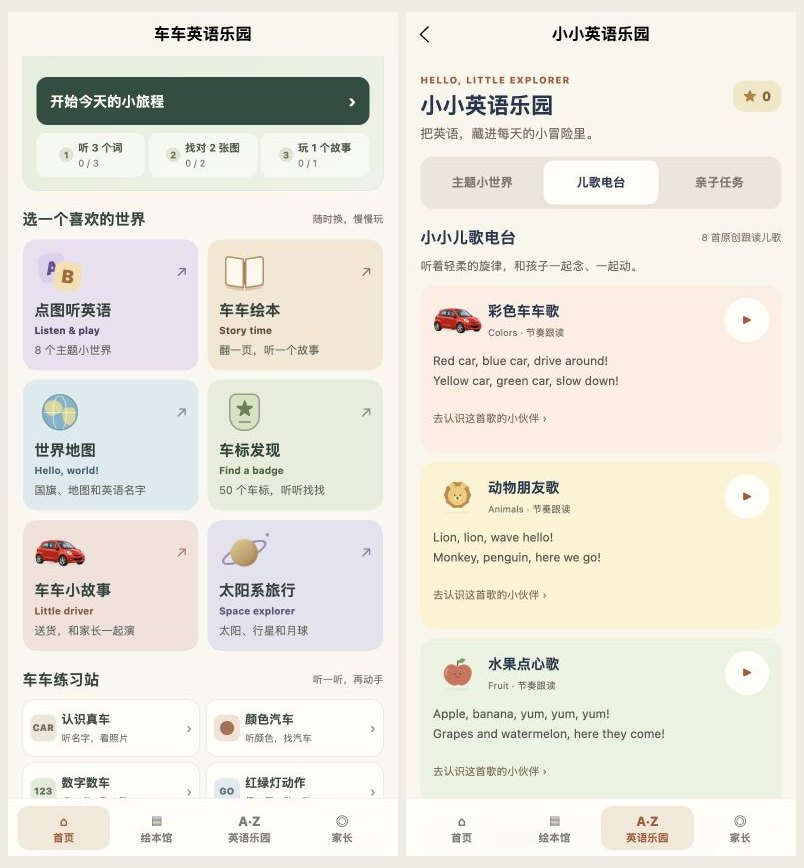

# 首页与陪玩入口重排（2026-10-04）

## 本次改动

- 首页缩小顶部图，按「今天的小旅程 → 六个世界 → 车车练习站 → 陪玩工具」排列。六个世界全部常驻，没有折叠入口。
- 世界地图、车标放在第二排；绘本与太阳系独立展示。六类入口使用不同的轻量插画，未新增包内位图。
- 顶部主按钮优先继续已有英语主题进度；无有效进度时进入今日未完成的活动；今日活动全部完成时提供再玩故事。累计学习报告保留在下方。
- 儿歌、亲子任务、录音小册从首页直接进入；儿歌和亲子任务页先显示对应内容，主题推荐仅在主题标签显示。标签和儿歌播放、返回主题按钮扩大至至少 44px。
- 保留工作区现有的太阳系内容、图片兼容和录音导出修复；运行包包含它们。本轮重点为排版和入口。

## 验证

- 类型、内容、冒险、学习/音频、录音导出、录音捕获、页面、媒体缓存、图片路由和太空测试通过（共 8 组行为测试）。
- 新回归检查覆盖：首页全部入口已注册；续玩优先级、无效进度回退、今日完成后入口；儿歌/亲子/录音直达；无效 tab 参数回退。
- 浏览器实际点击首页儿歌入口选中儿歌标签，点击亲子入口选中亲子标签；录音入口到达本机录音小册。本轮未录音、导入、导出或发送文件。
- 首页、儿歌、亲子任务在 320 / 390 / 430px 无页面级横向溢出；首页主按钮至少 48px，日常任务和儿歌播放按钮至少 44px。原始结果见 responsive.json。
- H5 构建和 211 张原图输出检查通过；微信小程序构建、分包依赖和包体检查通过。
- 使用 npm 11.19.0 在独立临时目录验证当前锁文件 npm ci --dry-run，解析通过。云端安装和完整构建以 GitHub Actions 的实际结果为准。

| 包 | MiB |
| --- | ---: |
| main | 1.477 |
| pkg-learning | 1.995 |
| pkg-cars | 1.559 |
| pkg-world | 0.389 |
| pkg-reading | 1.972 |
| pkg-user | 0.021 |
| pkg-adventure | 0.658 |
| pkg-space | 0.514 |

学习分包余量约 4.7 KiB，继续新增媒体前需要拆分。保持原门槛：主包 <1.5 MiB，各分包 <2 MiB，单个媒体 <=200 KiB。

本轮未重新操作微信开发者工具或手机实机；浏览器排版和构建通过不等于 iPhone 微信、录音权限和云端声音验收完成。已有原生检查范围见其他验收文档。

## 下一步方向（尚未实现）

1. **分包瘦身**：把儿歌、汽车练习拆成独立分包；保留旧分享路径的跳转，继续检查主包与分包的同步引用。目标是为新增内容腾出明确余量。
2. **收藏常玩入口**：让家长选择最多 3 个孩子喜欢的世界置顶，保存于本机；其余入口继续常驻。先用明确选择，不把点击次数当作孩子的能力或兴趣结论。
3. **完整成长备份**：在录音备份基础上包含绘本进度、国家探索和太空护照，提供版本校验、预览和合并恢复；跨设备接着玩。
