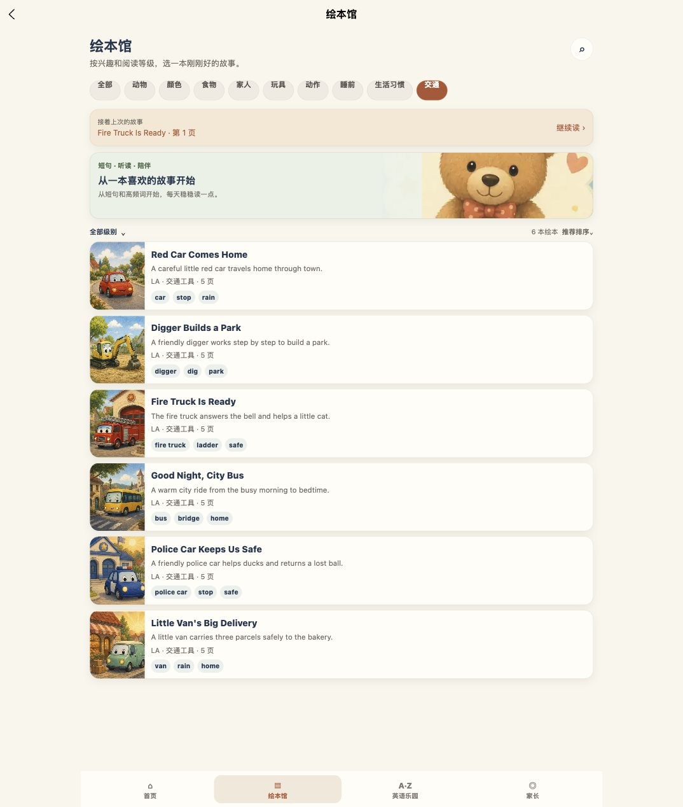
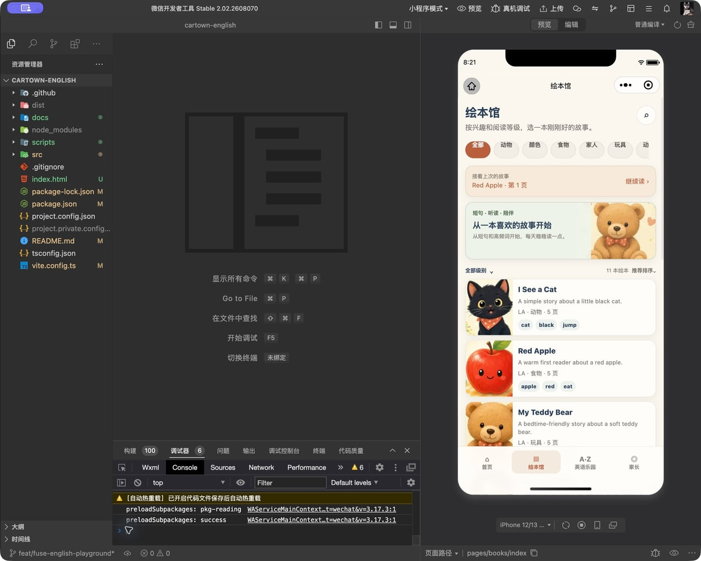
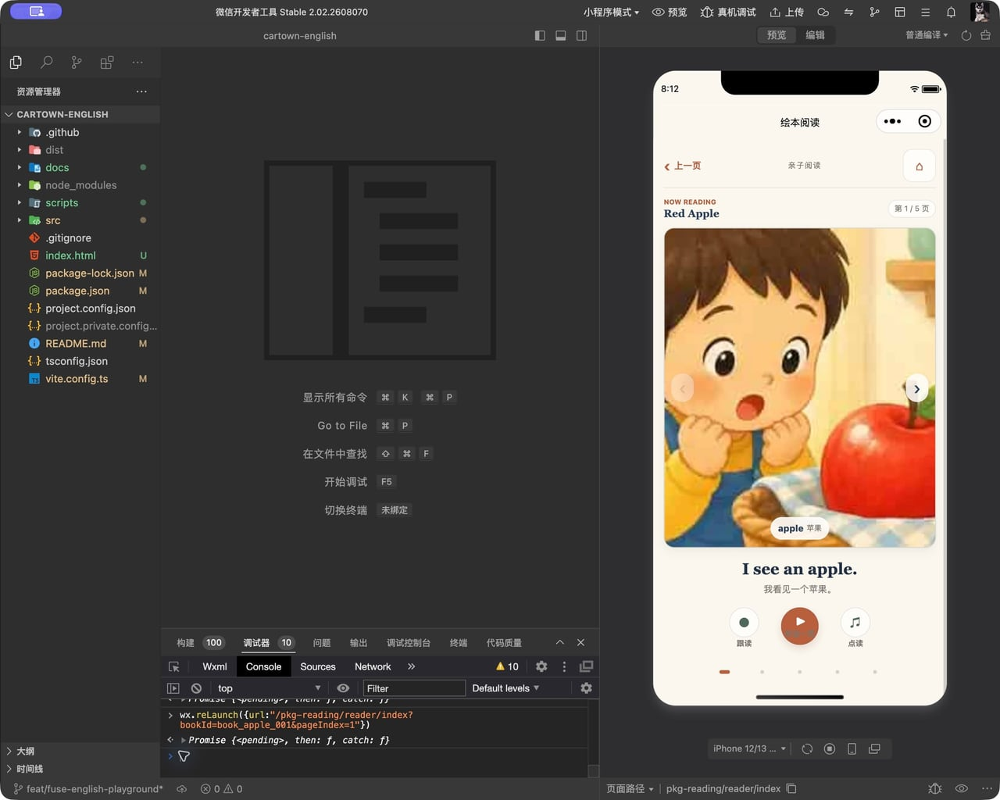
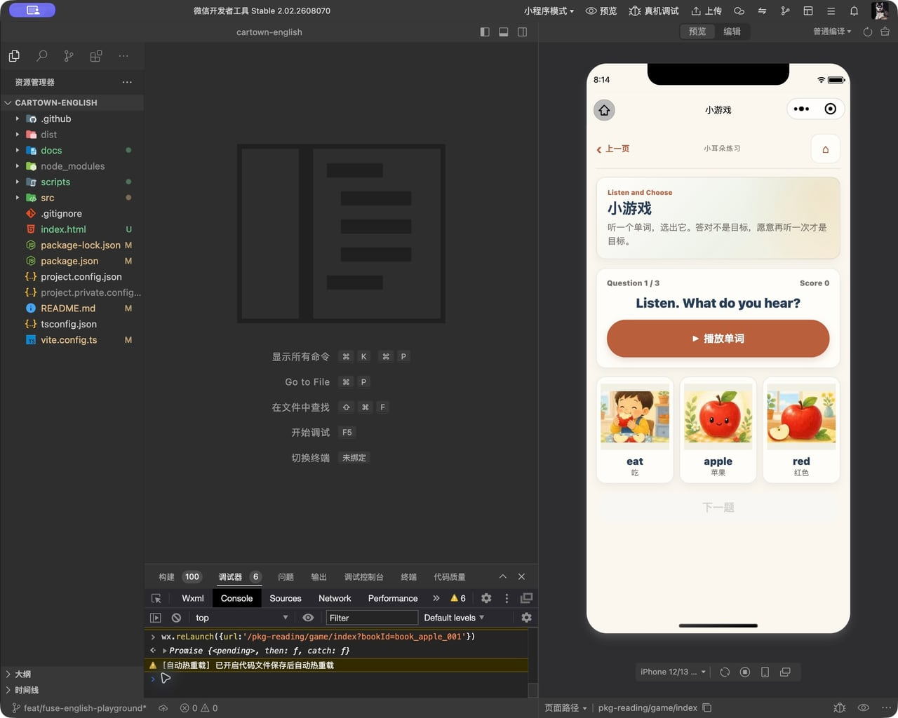
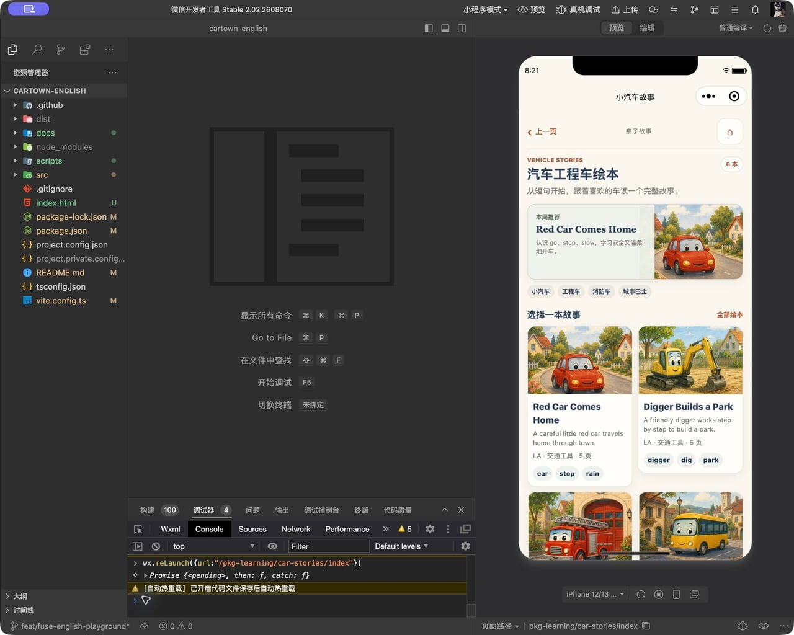

# 图片加载修复

日期：2026-10-04。

网页中的三本车辆绘本封面、车标，以及使用旧云资源路径的图片依赖微信 CloudBase 文件 ID。普通浏览器没有 wx.cloud，无法解析这些地址。原图已在仓库中，但网页构建此前没有包含它们。

## 修改

- H5 图片地址解析为同站静态资源，Vite 在网页构建中输出原有 211 张图片，开发服务器提供相同路径。微信小程序继续使用原有云资源方式；额外原图不会进入小程序包。
- 故事车辆使用阅读分包已有的词汇图片，减少云资源依赖。车标使用公共图片缓存组件。
- 保存网页入口 index.html，显式声明已有 H5 依赖；提供 dev:h5、build:h5 命令。
- 新增图片地址回归检查和构建后完整性检查，覆盖全部 211 张原图、重复地址解析、原有本地图片，以及小程序地址解析。

## 验证

- TypeScript 和原有内容、冒险、学习、录音、页面、媒体缓存检查通过，新增图片检查通过。
- H5 构建成功，211 张输出图片与原图字节一致。
- 浏览器生产构建与开发模式中，11 本绘本封面全部加载成功，50 个车标及当前选中车标共 51 个图片实例全部加载成功，无错误占位。
- 抽查挖掘机详情、消防车阅读、巴士点读、车辆总览、颜色、国家地图、真车照片、英语乐园；受检查图片均加载成功。
- 最终小程序构建与包体检查通过：主包 1.458 MiB、学习分包 1.994 MiB、阅读分包 1.970 MiB；所有分包低于原有门槛。
- 在微信开发者工具中已验证云端绘本文件取得临时地址成功（status=0），已生成开发预览二维码。尚未连接用户的苹果真机；手机端结果仍需用户扫码确认。未上传体验版、正式版或部署外部网页。

## 微信原生开发版与 iPhone 兼容修复

用户报告：iPhone 微信开发版中，绘本馆及 Red Apple 图片不显示。开发者工具模拟器不能代替苹果真机结论。

### 已复现与修复

1. 绘本小游戏的图片组件有额外原生宿主节点，百分比高度无法得到正确的父容器高度。原生模拟器中的三个选项只有空背景；启用 `virtualHost` 后三张图片实际显示。
2. 汽车故事页的推荐头图高度为零。为绝对定位图片增加专用布局容器，使用上下边界计算高度；同步整理绘本馆、家长页、车辆总览、世界图和故事场景中的图片容器。修复后推荐头图实际显示。
3. 微信组件的 tag 选择器不受支持，已将相关 view、text、button 样式改为 class 选择器。最终抽查未再出现此类 WXSS 警告。
4. 部分绘本页面收到图片失败事件就移除整个图片组件，重试按钮也被移除。基础绘本列表、详情、阅读及点读保留图片组件的重试入口；车辆绘本保留原有场景降级。
5. 基础绘本封面、正文、词汇与车辆图共 79 张包内 WebP 改为真实 JPEG，保持尺寸。此项规避较旧 iOS 的格式兼容风险，尚不能认定它就是用户设备的唯一原因。格式支持说明：[uni-app image 官方文档](https://uniapp.dcloud.net.cn/component/image?id=image)。云端原图保持原有格式及路径。

### 原生检查范围

在微信开发者工具实际打开全部 24 个登记页面检查页面是否渲染及控制台错误。对绘本馆、Red Apple 详情/阅读/点读/找图游戏、车标、颜色车、数字数车、交通动作、汽车故事、车库、车辆总览、真车卡、世界地图、主题游戏、送货/剧场和家长页查看实际屏幕。跟读、录音小册和资料页做页面加载检查，未触发录音权限或修改用户资料。

所检查页面控制台没有运行错误；仍有开发工具自动热重载、性能和模拟器音频配置提示。本次不是完整的真机录音/音频验收。

TypeScript、页面、图片路由、媒体缓存、冒险、学习、录音捕获/导出及 release 内容检查通过。新增 JPEG 文件头/文件尾检查覆盖全部 79 张包内图片；H5 构建完整性覆盖 211 张原图。

