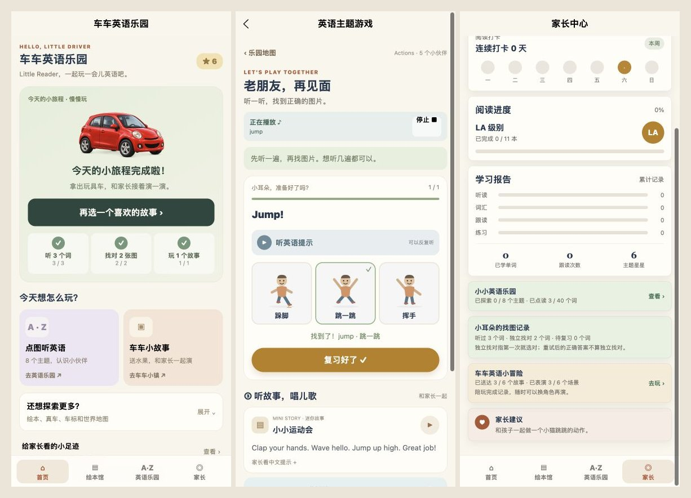

# 学习体验升级 · 2026-10-03

## 本次调整

- 儿童首页以一个今日小旅程为主入口：听 3 个不同单词、找对 2 张不同图片、完成 1 个故事。跨天重新计算；旧故事重玩也算今天的陪玩，星星只首次奖励。
- 保存点读位置、找图顺序、答题位置和重试状态；首页“接着上次玩”恢复英语主题游戏。
- 音频显示准备、播放、结束和失败状态，支持停止、重播及重试。家长资料页可调节并保存音量。
- 错词优先复习，独立找对后按 1、3、7 天安排再次见面。答错后的重试不计为独立找对，同一天重复答对不提升复习间隔。
- 家长报告区分听过、独立找对和待复习；旧版星星、故事记录和主题记录保留。新增记录仅保存在当前设备。

## 浏览器实际操作

通过本机 H5 预览在 390 × 844 手机尺寸操作：

1. 点读 clap、wave、jump，首页显示听词 3 / 3；退出后恢复第 3 个词。
2. Jump 题先选错再选对，显示待复习 1 个词，独立找对仍为 0。
3. 退出并恢复，保留已答对的第 1 题；下一题 Wave 独立答对，首页找图 2 / 2、独立找对 1。
4. 从首页复习 Jump，只有 1 / 1 题；复习完成后待复习归零，独立找对 2，星星仍为 6。
5. 重演已完成的泡泡洗车屋，今日故事 1 / 1；首页三个步骤全部完成，星星仍为 6。
6. 家长报告同步显示听过 3、独立找对 2、待复习 0；资料页显示音量 100%。
7. 首页在 320、390、430 px 宽度下检查，页面宽度与滚动宽度一致，无横向溢出。

截图是上述真实浏览器操作的组合，未模拟进度。

## 自动验证与限制

- TypeScript、内容校验、小冒险进度测试、新增学习和音频测试通过。
- 微信小程序与 H5 构建通过。微信包检查：主包 1.406 MiB，学习分包 1.932 MiB，小冒险分包 0.657 MiB；全部分包符合项目包体门槛。
- 本次未执行微信原生开发者工具、真机或体验版上传；音频手感及后台行为仍需在微信真机复核。
