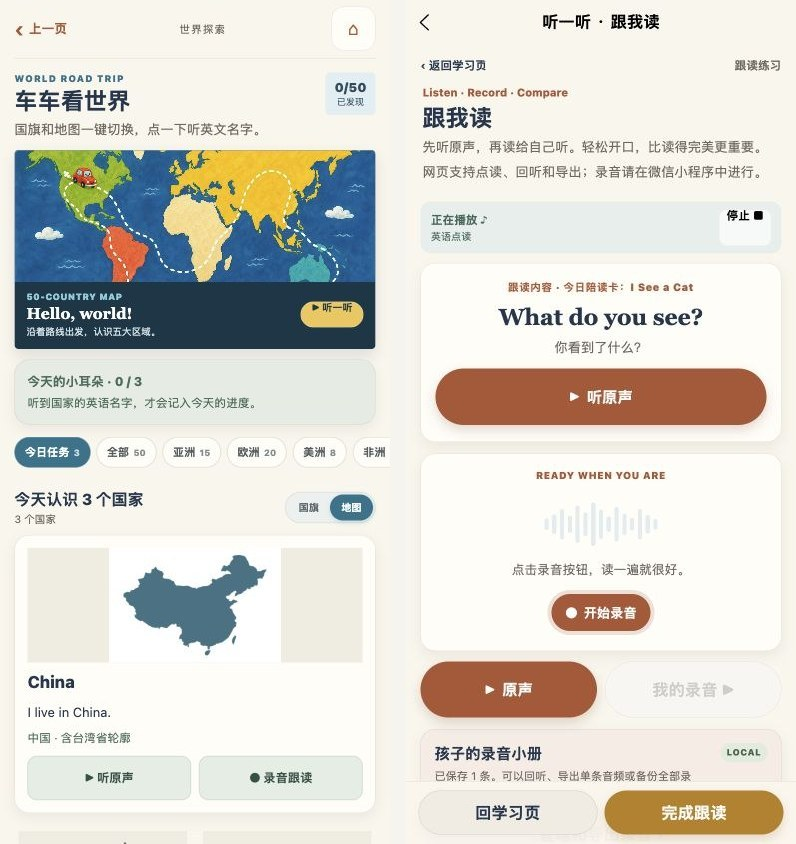
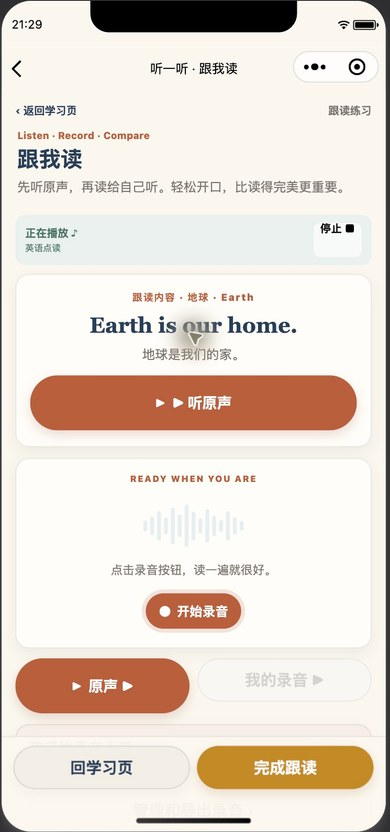

# 中国地图与全内容跟读（2026-10-05）

## 本轮修改

- 中国形状卡加入台湾省，与大陆、海南岛使用同一种颜色。540×360 PNG 由公有领域地理坐标生成；源数据、SVG、重建脚本与像素测试一起保存。卡片标注“中国 · 含台湾省轮廓”。
- 14 个教学内容页面接入跟读：交通工具、车型、车标、颜色/数数/交通动作、国家、主题词汇/提示/故事/儿歌/亲子示范句、儿歌电台、行星、配送台词、亲子剧场、绘本目标/词汇/热点/句子/陪读问题。绘本阅读页已有入口和旧分享链接保留。
- 复用录音小册：听示范读音 → 开始/停止录音 → 回听 → 导出单条音频或 JSON 备份。绘本旧入口保持 10 秒，新内容最长 30 秒；录音存本机。网页支持点读、回听和导出，录音操作明确指向微信小程序。
- 新建 `pkg-speaking`；50 段车型短句、8 条亲子示范句、32 个不重复的绘本陪读问题，共 90 个离线 MP3。沿用 Piper en_US-ljspeech-high 声线；模型和生成依赖不打包。
- 缓存短路由与内容快照，修复微信参数未解码导致跟读内容丢失的问题。录音保存对应句子和来源标题；准备/录制/保存或待重试时，页面按钮阻止离开。页面层级过多时重新打开正确的学习来源。分享学习内容页，避免分享本机缓存标识。
- 扩展跨分包媒体异步加载，使用微信小程序 `require.async`。新增国家点读入口实际播放成功后才更新进度。

## 已完成的检查

- `npm test`、严格发布内容检查、H5 构建与微信小程序构建通过。529 组上下文覆盖音频路径和返回路线，不表示 529 个不重复的新增内容。
- 录音服务测试：10/30 秒、原生开始事件、手动/自动停止去重、权限取消、保存失败重试、来源快照、错误链接拦截、返回学习页和回听状态。备份往返保留来源标题，兼容旧备份；导出使用安装版本的 uni-app 事件派发器验证文件字节和用户点击流程。
- 90 个新 MP3 均成功解码，无空白音频。H5 的 588 个原始媒体逐文件字节验证；新增包内文件随 H5 输出。
- 地图测试读取 PNG 像素，核对大陆、海南与台湾省都被绘入，台湾坐标范围和闭合路径正常。
- 网页实际操作 14 个内容页：进入跟读、核对英文、播放原声（收到播放状态）、返回对应学习页。额外验证陪读提问音频。
- 网页 14 页 × 320/390/430px 共 42 个排版检查，未发现页面级横向溢出或已加载图片破图。
- 微信模拟器实际打开 13 个内容来源的跟读入口，核对句子与来源，运行错误为 0；行星跟读页跨分包原声播放成功。清单见 `native-follow-audit.json`。电脑随后自动锁屏，工具不能解锁；新增交通工具卡片和陪读提问的最后一轮原生复验未完成，网页已确认。
- 小程序最终包：总计 9.867 MiB，主包 1.486，阅读 1.963，学习 1.364，车辆 1.649，世界 0.395，冒险 0.660，太空 0.515，儿歌 0.615，跟读 1.200 MiB。主包 <1.5、单包 <2、总包 <20、单媒体 <200 KiB；实际异步模块路径和分包间同步引用检查通过。

## 尚未确认

未采集真实儿童声音，未调用实体手机麦克风，也未执行微信文件发送或确认真实手机保存落盘。录音捕获、导出字节和失败重试由受控原生事件及文件样例验证；这些测试不代替手机微信验收。未提交审核或上传体验版，保留 GitHub 草稿 PR。

