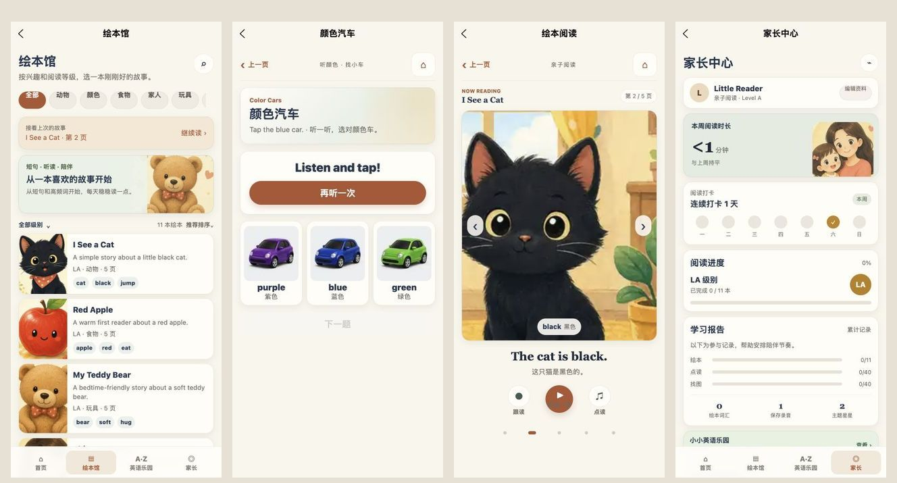

# 全页面体验与工程检查

日期：2026-10-03。目标平台：uni-app 微信小程序。共 24 个注册页面。

## 本次交付

| 页面或公共能力 | 改进 |
| --- | --- |
| 绘本馆 | 继续上次阅读、搜索和筛选空结果恢复、真实封面、明确阅读入口 |
| 绘本详情、阅读、点读 | 返回详情后刷新进度；无效书籍回退并提示；页码取整并限制范围；翻页停止旧声音；点读和底部按钮适配窄屏；页码圆点扩大点击区域 |
| 绘本游戏 | 用真实词汇图片替换首字母占位；选择位置打乱；明确对错反馈；完成成绩只保存一次 |
| 车辆总览、真车卡片 | 统一返回/首页入口；真车发音实际开始后才标记听过并首次奖励；切换页面清理音频 |
| 颜色、车标、动作 | 随机选择位置；答对停留，主动点击下一题；同一轮重复点击不重复奖励；车标目标覆盖全部 50 种；动作增加再听一次 |
| 数车 | 展示数量与题目完全一致，每辆只计一次；最后一个数字不会被表扬声音打断；已点数量反馈；完成后才能进入下一题 |
| 故事列表、奖励车库 | 统一卡片与导航；车库返回后重新读取星星；显示收藏数和下一辆解锁目标 |
| 世界地图 | 当天点读与历史探索分别保存；播放实际开始后才记入当天；同日去重、跨天重置、返回刷新 |
| 家长中心 | 显示绘本完成数、点读数、独立找对数；移除把参与次数换算成能力分的展示；录音数量标明为已保存录音 |
| 设置 | 昵称去空格并限制 16 字，空昵称有提示；直接打开录音备份；明确清除范围并同时清除国家探索；保留音量 |
| 乐园、冒险、录音等现有页面 | 统一导航防重复、失败提示和返回回退；保留已完成的学习与录音功能；冒险文案明确保留完成印章，未承诺中途步骤恢复 |
| 图片与音频 | 图片加载、错误及重试状态；失败缓存失效后再下载；清理缓存时不被未完成下载重新写入；H5 外部媒体直接使用 URL；捕获云资源失败 |
| 公共视觉与交互 | 圆角、柔和底色、安全区、按钮语义、焦点样式和减少动态效果；主要操作与返回按钮至少 44 px 高 |

新增 79 张离线图片：5 张基础绘本封面、25 张内页、30 种车辆、19 张词汇图。均由仓库已有高清原图缩小导出，未引入新的第三方图片。WebP 参数：绘本宽 400 / quality 40；车辆最长边 160 / quality 38；词汇最长边 200 / quality 40。原图仍保留在 `docs/source-assets`。

更多页面见 [完整预览](all-pages.jpg)。截图中的昵称、学习活动和录音数量来自独立的本地测试预览；唯一录音样例已标注为英语示范音频，不是孩子的录音。

## 验证

- TypeScript 检查及严格发布内容校验通过。
- 冒险、学习/音频、录音导出、录音捕获、页面行为、媒体缓存六组回归检查通过。
- 新页面检查覆盖导航防连点、页面栈满时回退、失败重试、无回调释放；异常分享文本和页码边界；选择随机位置；每轮一次奖励；数车数量和去重；当天国家听读及跨天重置；绘本游戏完成去重；79 张图片引用存在。
- 新媒体检查覆盖缓存复用、坏文件重试、清理时下载未完成、云资源失败后恢复、H5 直接 URL 和云不可用拒绝。
- H5 和微信小程序构建通过；主包不直接同步引用分包，媒体不超过 200 KiB。
- 浏览器在 320 / 390 / 430 px 对全部 24 个注册页面检查：内容存在、页面级无横向溢出。原始结果见 `viewport-*.json`。
- 浏览器实际走通：搜索无结果 → 重置；绘本详情 → 第 2 页 → 返回显示继续第 2 页；颜色选择 → 反馈 → 重复点击 → 主动下一题；真车音频开始播放 → 已听过 1 辆及首次奖励 → 返回首页清理播放状态；无效绘本及页码 999 首次加载 → 推荐绘本第 5 页。
- 新增 GitHub Actions 工作流，在推送与 PR 上执行 npm test、严格发布校验和小程序构建，并保存构建产物。云端运行状态以 GitHub Actions 实际结果为准。

### 最终包体

| 包 | MiB |
| --- | ---: |
| 主包 | 1.455 |
| 学习 | 1.990 |
| 真车 | 1.559 |
| 世界 | 0.389 |
| 阅读 | 1.970 |
| 家长 | 0.021 |
| 冒险 | 0.657 |

原门槛保持：主包小于 1.5 MiB，各分包小于 2 MiB。学习分包剩余空间较小，后续增加媒体应优先拆分或压缩，并继续运行包体检查。

## 原生验收范围

本轮验证使用浏览器和接口模拟，未在微信真机进行完整验收，未上传体验版或提交审核。微信的首次分包加载、云端图片/语音权限、静音开关、后台/前台、原生录音和微信文件发送仍需实机确认。

浏览器没有微信云环境，依赖云端的旧绘本/部分练习语音会展示加载失败和重试；本轮验证了失败反馈与离开页面清理，没有将它们报告为浏览器发音成功。真车包内 MP3 已实际触发播放和学习记录。基础绘本与车辆/词汇图片已随包提供。

没有性能压测、设备矩阵和应用商店审核结果，因此这次交付作为全页面统一与工程检查基线，不作为生产上线验收结论。
