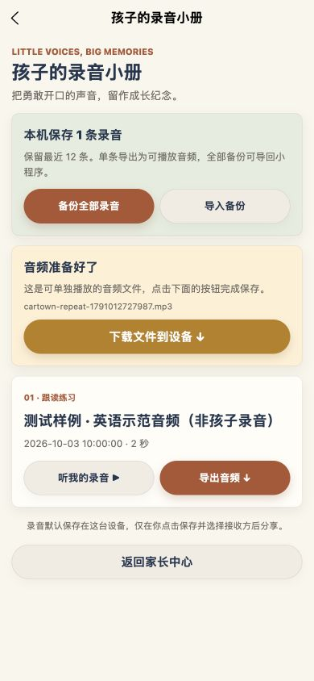

# 录音导出与恢复 · 2026-10-03

## 使用方法

1. 绘本“跟我读”录完后，点“保存 / 导出我的录音”，或从家长中心打开“孩子的录音小册”。
2. 单条“导出音频”生成可播放 MP3；导入的 WAV 等音频保留对应格式。文件准备后，再点击“保存到微信文件”。
3. 在微信中选择文件传输助手或自己的聊天，发送后可在聊天文件里收藏、下载到电脑。分享成功才提示已发送；取消和失败不会提示成功。
4. “备份全部录音”生成含音频和句子记录的 JSON，供“导入备份”恢复；JSON 不能直接当作音频播放。
5. 保留最近 12 条，恢复时合并去重。导出时跳过失效或过大的文件并显示数量；没有可用录音时明确提示。

## 检查范围

- 自动测试：单条音频的字节保持一致、MP3/WAV 扩展名、用户再次点击才分享、分享取消与失败、空列表、失效文件数量、JSON 完整往返、恢复路径唯一、清理导出副本不删除原录音、网页 Blob 和下载按钮。
- 浏览器：在独立的 localhost:4174 测试数据中，通过真实文件选择导入 1 条明确标注“测试样例 · 英语示范音频（非孩子录音）”的合成语音，显示正确数量；实际准备单条音频和全部 JSON 备份。390 px 截图，320 px 无横向溢出。
- 点击网页下载后，内置浏览器未返回下载事件或文件路径，未确认落盘。自动测试已确认生成的音频 Blob 字节一致，但浏览器最终下载仍需普通浏览器复核。
- TypeScript、新增录音导出测试、发布内容校验、微信小程序构建与包体检查通过。主包 1.406 MiB，阅读分包 1.706 MiB。
- 本次未使用真实儿童录音，也未执行微信原生开发者工具或真机文件发送；微信“选择接收方 → 发送 → 保存”需真机检查。体验版未上传。

## 实现修正

原备份使用 openDocument 打开 JSON，并忽略打开失败；现在使用微信文件分享入口。导出准备和分享分开，避免异步文件读取消耗用户手势。修复多条恢复录音文件名碰撞；切到录音小册或离开页面时停止回放，跟读记录保存后立即落到本机存储。

