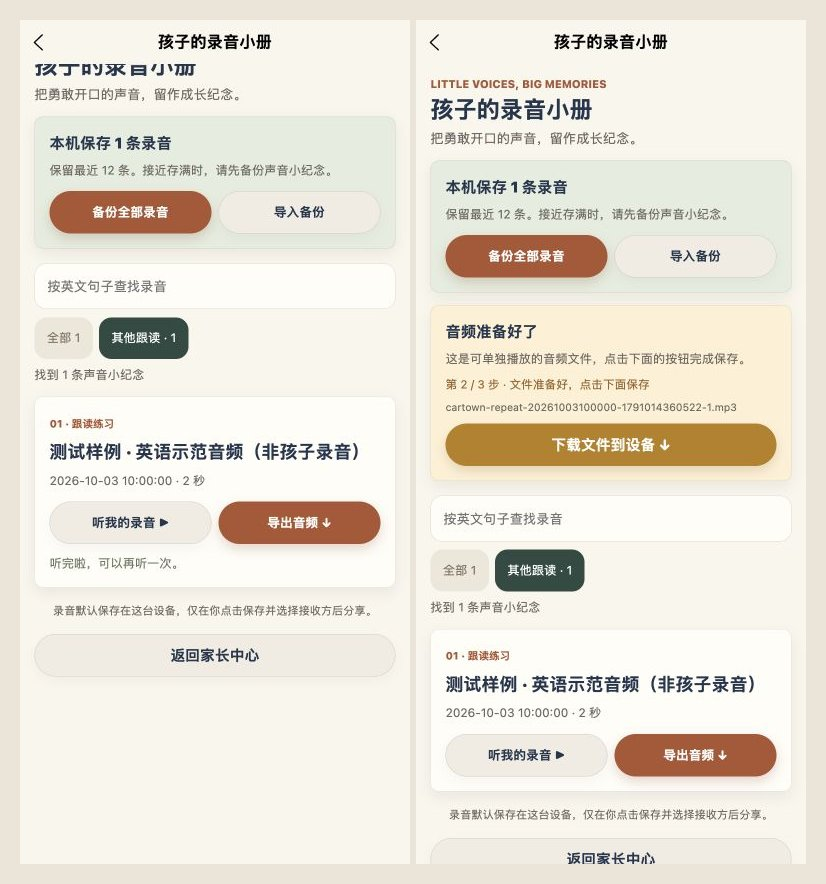

# 录音保存与回听优化 · 2026-10-03

## 本轮改动

- 等待系统确认开始录音后再计时；启动阶段防止连续点击，原声和回放在录制期间禁用。
- 原生监听只注册一次，10 秒自动停止和手动停止共用保存结果，避免漏存或重复保存。App 和页面切后台停止录制、回放；保存失败保留临时路径，在当前页面可重新保存。
- 回到同一句跟读时加载最近的录音。网页提供回听与导出；录制入口明确提示使用微信小程序。
- 录音小册支持句子搜索、绘本筛选、无结果恢复、回放状态和停止；达到 10 条时提示备份，保留最近 12 条。
- 备份导入先核对本机已有文件，已存在的有效录音不再写一份；文件缺失时恢复并替换路径，保留原记录身份与数量。报告分别显示新增、修复、重复、无效及超出数量。
- 导出文件名包含录音日期和序号。换一条准备时清除上一条副本；页面已退出时不留下迟到的导出副本。下载按钮提示已请求下载，并提供检查下载列表的说明。

## 验证

- 自动测试：实际开始前等待、防止重复启动、手动停止仅保存一次、原生自动停止保存、启动/运行错误、保存失败重试、权限期间取消、开始前请求停止、回放音量和过期回调隔离、缺失文件修复但不新增记录。
- 导出测试：音频字节与格式、JSON 往返、取消/失败提示、重复导入不写新文件、同一备份内部去重、缺失路径恢复、唯一导出/导入路径和原文件保护。
- TypeScript、内容发布校验、原学习与小冒险测试、H5 和微信小程序构建通过。主包 1.410 MiB，阅读分包 1.712 MiB，其余各包均符合项目门槛。
- 调整公共录音服务到主包，App 切后台直接引用；检查脚本验证这一真实入口引用，仍检查主包不得同步加载分包、旧构建残留、媒体和包体限制。
- 浏览器使用原独立 localhost:4174 的合成语音测试样例，实际验证搜索无结果与恢复、绘本筛选、回放状态、准备音频及下载请求说明。390 px 截图，320 px 无横向溢出。没有使用真实儿童录音。
- 微信真实麦克风、后台中断及文件发送仍需真机确认。内置浏览器下载落盘未确认；本轮没有上传体验版。

