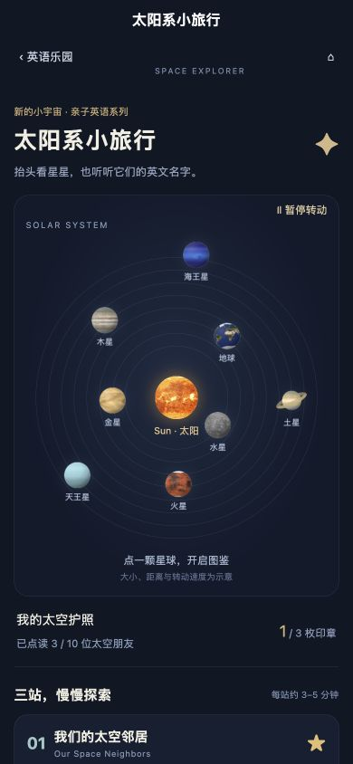
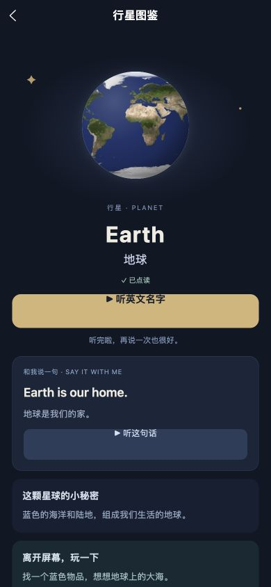
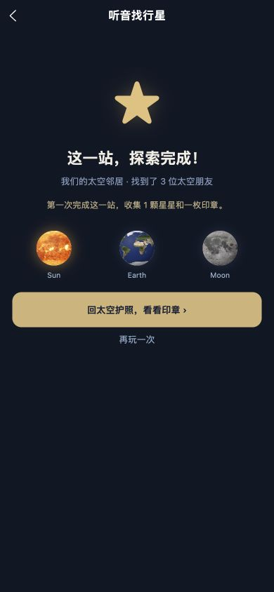
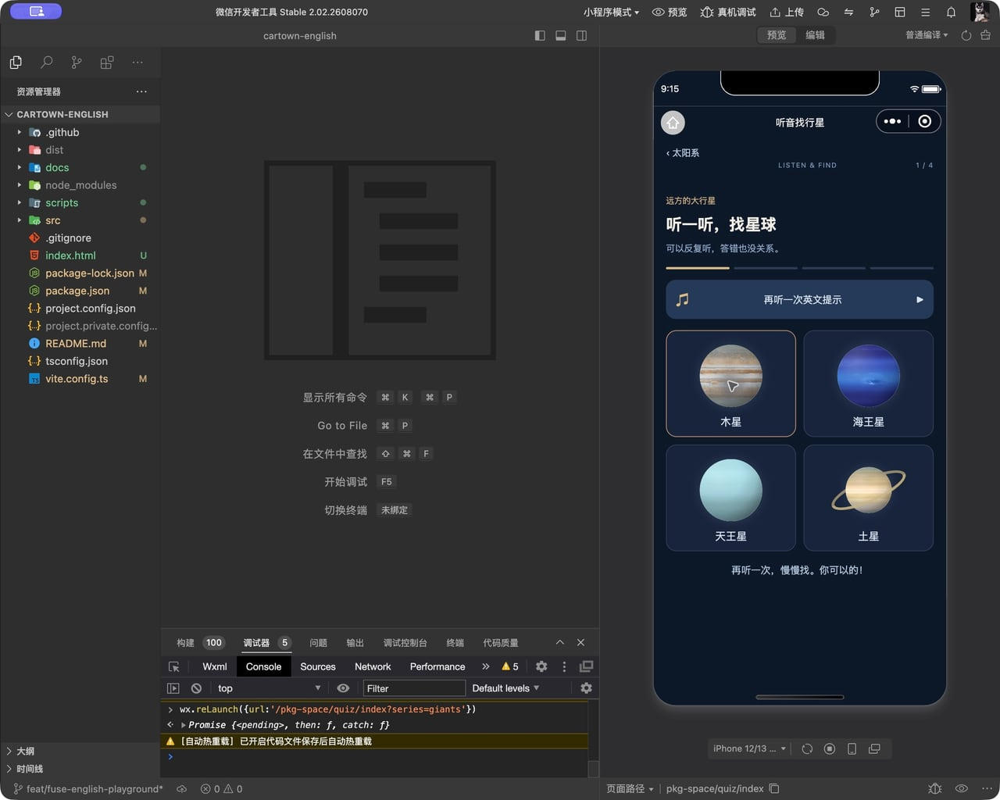

# 太阳系英语主题验收（2026-10-04）

## 已实现

英语乐园顶部与首页更多探索接入太阳系主题。三组系列覆盖太阳、八大行星和月球；提供可暂停的轨道示意、10 份双语图鉴、32 段离线点读/提示/反馈音频、亲子任务和听音找图。太空护照记录实际开始播放的点读，整组完成仅首次奖励一颗全局星星。清除学习记录同时清除太空护照。

## 验证

- H5 iPhone 390×844：图鉴点读、错误重试、正确反馈、下一题、完整三题、星星和印章回到护照，均通过真实页面操作。
- 微信开发者工具 iPhone 12/13 模拟器：九个轨道天体图片、地球大图与发音、四颗外行星图片、找图提示与答错反馈正常。实际点读后标记“已点读”；未出现新主题图片或离线音频失败。
- 初次 QA 发现鼓励语调用旧云端音频；已替换为本分包离线文件，修复后完整游戏通过。
- 初次打包器将共用进度函数合并到分包；已把共用数据/进度放入主包代码目录，移除主包同步引用分包的问题。图片与音频仍在独立分包。
- 主包 1.466 MiB；英语学习分包 1.995 MiB；太空分包 0.514 MiB，包大小门禁通过。
- 类型、内容、原有冒险/学习/录音导出/录制/页面/缓存/图片，以及新增太空测试全部通过。
- 微信测试前后的太空及全局学习存储恢复一致，未保留模拟测试奖励。

## 边界

已验证网页与微信模拟器，iPhone 微信实机需要扫码验收。地图距离、大小、转动速度为示意，不是天文模拟。纹理为 Solar System Scope 科普重建图，非未经加工的航天器照片。

