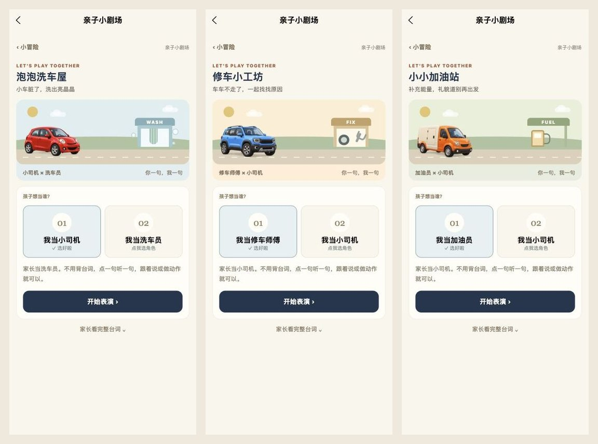

# 车辆插画升级

2026-10-03：将小冒险场景和乐园颜色学习里的重复车辆，替换为六款更接近真实汽车、轮廓各异的可爱 3D 插画。

## 素材与接入

- 红色小轿车、蓝色 SUV、黄色出租车、绿色小巴士、紫色水果皮卡、橙色送货车。
- 车门、后视镜、车灯、轮胎、车窗及车身比例各不相同；统一透明背景和柔和光照。
- 六个剧场分别使用六款车；配送任务按照已选颜色显示对应车型，选车卡片增加车型名称；乐园五张颜色卡片和地图入口一起更新。
- 素材使用内置 image_gen 生成。最终完整提示词见 [prompts.md](prompts.md)。
- 六款最终 PNG 保存在 `src/pkg-adventure/static/art/`，颜色学习所需五款另存于 `src/pkg-learning/static/playground/art/`，分包素材独立。
- 发布图片为 480 × 320 透明 PNG，单张约 38–50 KiB；移除八张已被替换的旧车图。

## 检查

- TypeScript、严格发布内容校验、小程序构建和分包引用/大小检查通过。
- 主包 1.355 MiB，学习分包 1.929 MiB，冒险分包 0.656 MiB；所有分包低于 2 MiB。
- 电脑浏览器实际检查洗车、修车、加油、选车与颜色卡片页面；390 px 视口截图确认车辆完整显示、三种选车轮廓不同、五色缩略图正常加载。
- 旧进度保持送货 3/6、剧场 3/6、6 颗星。
- 微信实体手机尚未验证，体验版未上传。
